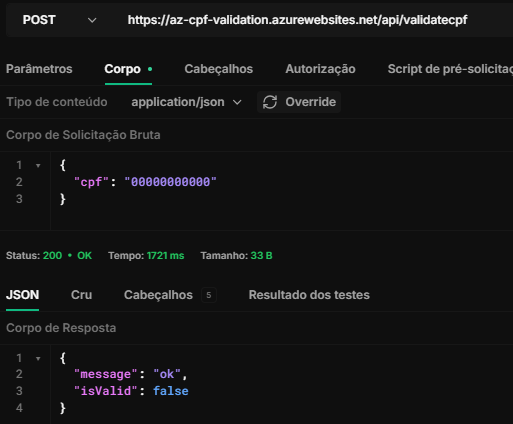

<h2 align="center"> Microsoft Azure: Serverless Functions </h2> <p align="center"> Implementação de uma função serverless consumida via requisição HTTP </p> <hr>

### 💻 Stack
Principais tecnologias utilizadas:


<hr>

### 🚀 Objetivo do Projeto
Projeto desenvolvido para fins de aprendizado, explorando como funções serverless funcionam na plataforma Azure. O exemplo em questão implementa um microsserviço responsável por validar CPF's.


### ⌨️ URL em Produção:
```bash
# Methods: POST
$ https://az-cpf-validation.azurewebsites.net/api/validatecpf
```

#### Corpo da requisição:
```bash
{
  "cpf":string
}
```
🎯 Exemplo
<p align="center">  </p>
<hr>

### 🌍 Localhost:
Para reproduzir a função em localhost, basta seguir os seguintes passos (depois de autenticado na Azure):

1. **Clonar o repositório:**
    - Clone o repositório para sua máquina local utilizando o comando:
      ```bash
      git@github.com:reidn3r/serverless-cpf-validation.git
      ```

2. **Criar um projeto de função serverless na Azure:**
    - Crie uma **Function App** na Azure usando o portal ou a Azure CLI.

3. **Configurar o arquivo local.settings.json:**
    - Adicione as credenciais de Storage Account necessárias (padrão)

4. **Executar a função localmente:**
    - Com o ambiente configurado, execute a função localmente com o seguinte comando:
      ```bash
      npm run start
      ```
    - Isso iniciará a função na sua máquina local, permitindo que você a teste antes de fazer o deploy na Azure.
